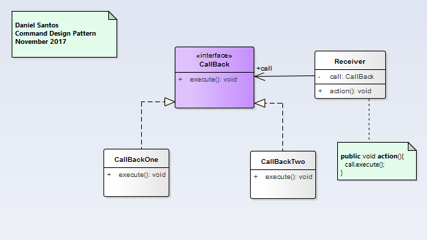
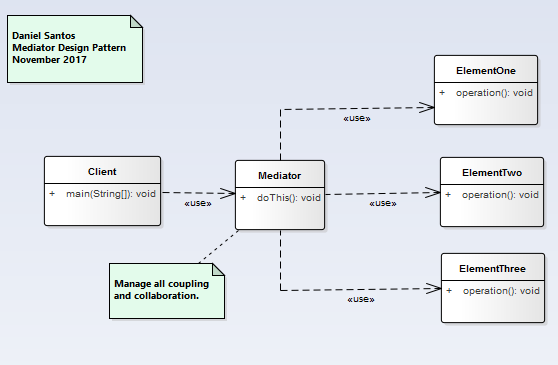
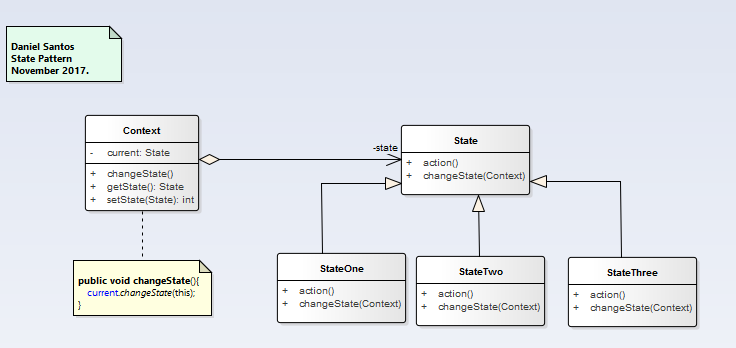
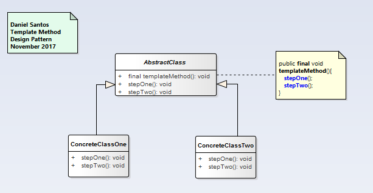

# Behavioral patters   Patterns
  - Deal with assigning responsibilities between different objects. Describe the communication mechanism between objects, define a mechanism for choosing different algorithms by different objects at runtime..

### [Command](Command/readme.md)
  - Allow a request to be encapsulated into a object, thereby letting you parametrize clients with different request.

### [Interpreter](Interpreter/readme.md)
  - Helps to interpreting operations using its grammar.
  - Given a language,   define a representation for its grammar along with an interpreter that uses the representation to interpret sentences in the language.

### [Mediator](Mediator/readme.md)
  - Encapsulates the direct object communication details among a set of objects in a separate (mediator).
  - Define an object that encapsulates how a set of objects interact.

### [Memento](Memento/readme.md)
  - Allows the state of an object to be captured and stored.

### [Observer](Observer/readme.md)
  - Promotes a publisher-subscriber communication model when there is a one-to-many dependency between objects so that when on objects change of state, all of its dependents are notified so they can update their state.
  - Define a one-to-many dependency between objects so that when one object changes state, all its dependents are notified and updated automatically.

### [State](State/readme.md)
  - Allow to encapsulate the different states of an object as an object, which specific state mapped onto an object.
  - Allow an object to alter its behavior when its internal state changes. The object will appear to change its class.

### [Strategy](Strategy/readme.md)
  - Allows each of a family of related algorithms to be encapsulated into a set of different subclasses (strategy objects) of a common superclass.
  - Define a family of algorithms,  encapsulated each one and make them interchangeable.

### [Template](Template/readme.md)
  - Define the skeleton of an algorithm in an operation.

