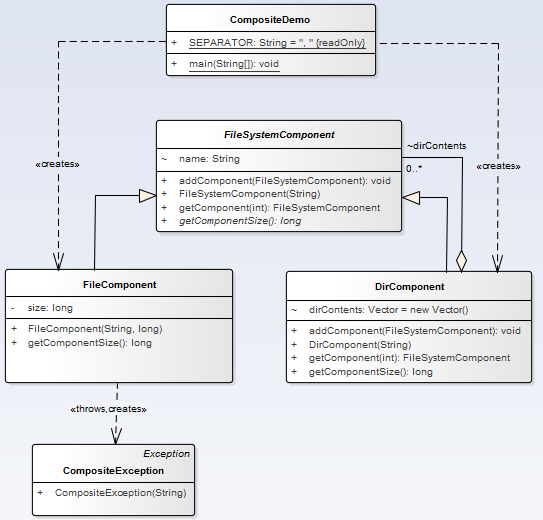

# Composite

>"Compose objects into tree structures to represent part-whole hierarchies. Composite lets clients treat individual objects and compositions of objects uniformly." [GoF]

## Model

## Example

### Functional Model
  

### Structural Model
  
