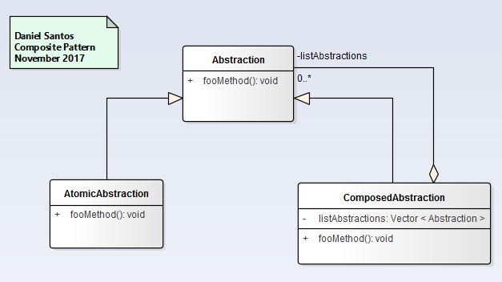

# Collectional Patterns
- Deal with the details of how to compose classes and objects to form larger structures.

### [Composite](Composite/readme.md)
  - Allows both individual objects and composite objects to be treated uniformly.
  - Compose objects into tree structures  to represent whole-part hierarchies.

### [flyweight](Flyweight/readme.md)
  - The invariant information are separated into two classes leading to savings in terms of the memory usage and the amount of time required to create a large number of instances.
  - Use sharing to support large numbers of fine grained objects efficiently.

### [Iterator](Iterator/readme.md)
  - Access the contents of a collection without having any knowledge about the internal representation of its contents.

### [Visitor](Visitor/readme.md)
  - Allows to add a operation to be defined across a collection of different objects without changing the classes of objects on which it operates.

