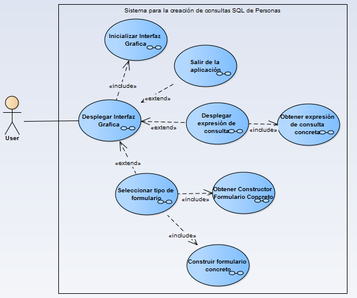
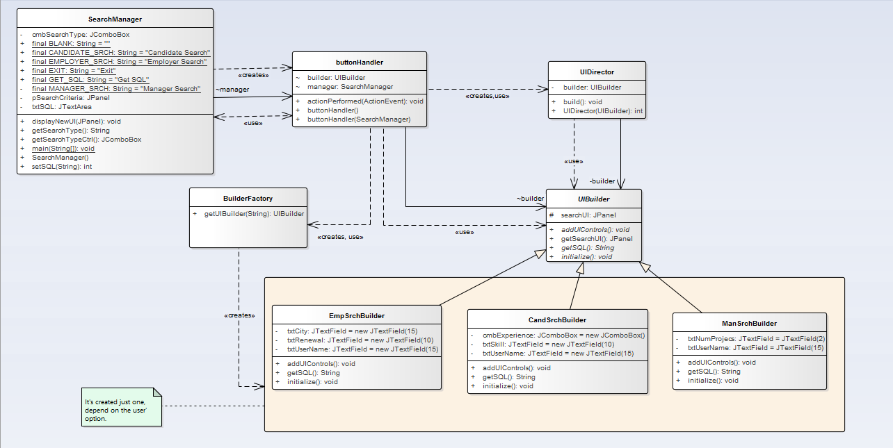

# Builder

__"Separate the construction of a complex object from its  representation so that  the same construction process can create different representations."__ [GoF]

## Model

## Example

### Functional Model
  

### Structural Model
  
