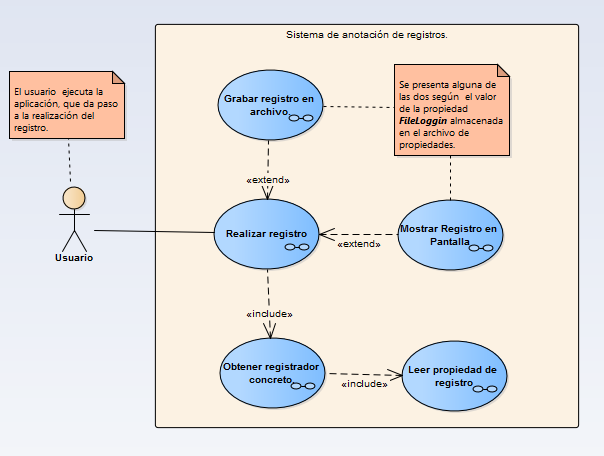
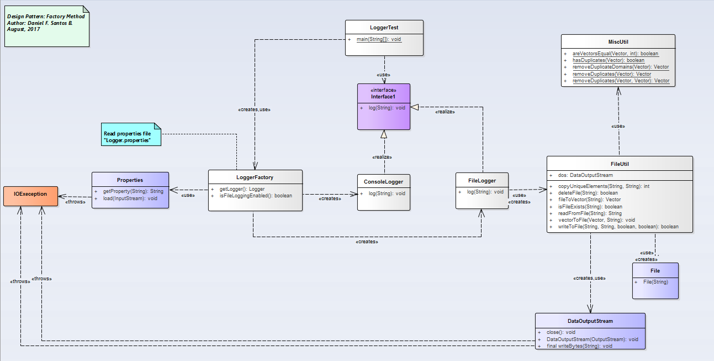

# Factory Method

__"Define an interface for creating an object, but let subclasses decide which class to instantiate. Factory Method lets a class  defer instantiation  to subclasses."__ [GoF]

## Model

## Example

### Functional Model
  

### Structural Model
  
