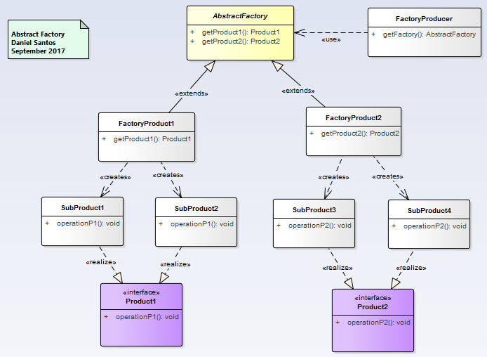
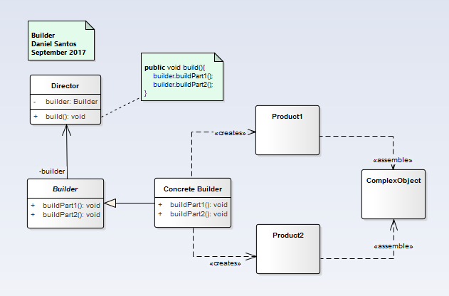
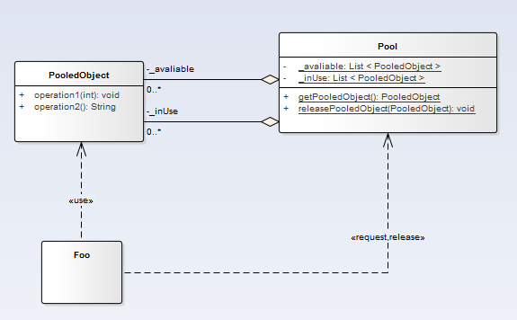

# Creational Patterns
 Provide ways to create objects while hiding the creation logic.

### [Abstract Factory](abstract_factory/readme.md)

  __"Provide an interface for creating families of related or dependent object without specifying their concrete classes."__ [GoF]

  

  #### [See the example](abstract_factory/readme.md)

### [Builder](builder/readme.md)

  __"Separate the construction of a complex object from its  representation so that  the same construction process can create different representations."__ [GoF]

  
  #### [See the example](builder/readme.md)

### [Factory Method](factory_method/readme.md)

  __"Define an interface for creating an object, but let subclasses decide which class to instantiate. Factory Method lets a class  defer instantiation  to subclasses."__ [GoF]

  
  #### [See the example](factory_method/readme.md)

### [Object Pool](object_pool/readme.md)

  __"Offer a mechanism to kept ready a set of objects that are expensive to create "__

  
  #### [See the example](object_pool/readme.md)

### [Prototype](prototype/readme.md)

  __"Specify the kinds of objects to create using a prototypical instance and create new objects by copying this prototype ."__ [GoF]

  
  #### [See the example](prototype/readme.md)

### [Singleton](singleton/readme.md)

  __"Ensure a class has only one instance, and provide a global point of access to it."__ [GoF]

  
  #### [See the example](singleton/readme.md)
