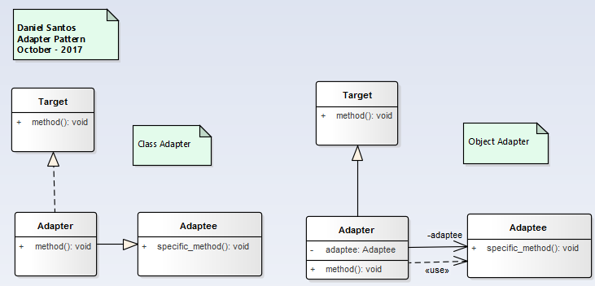
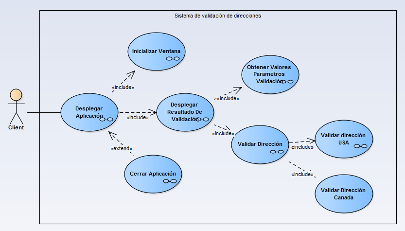
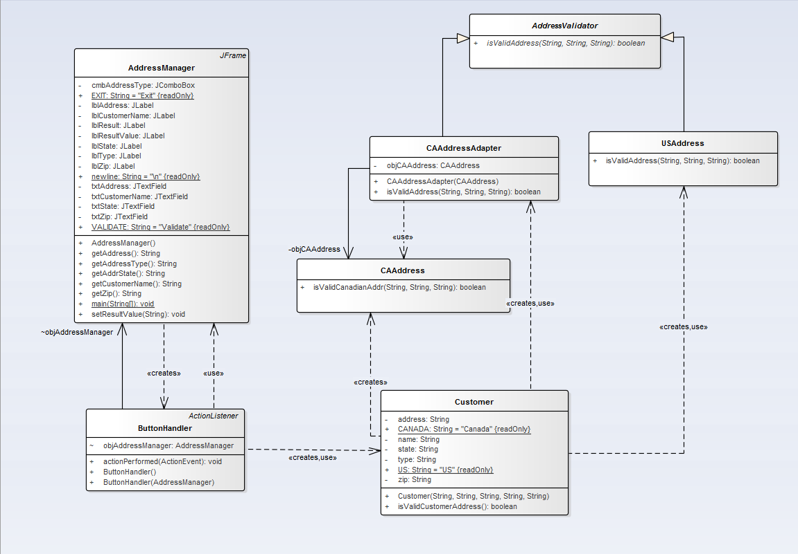

# Adapter

>"Define a separate Adapter class that converts the interface of a class (Adaptee) into another interface (Target) clients require. Work through an Adapter to work with classes that have not the required interface"

## Model

## Example

### Functional Model
  

### Structural Model
  
