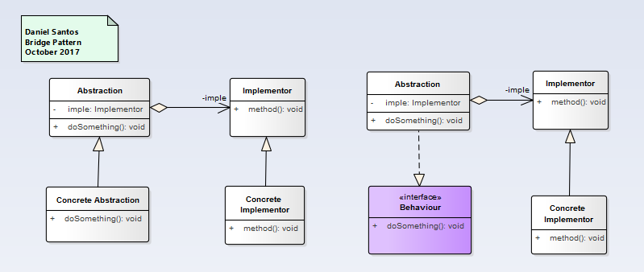
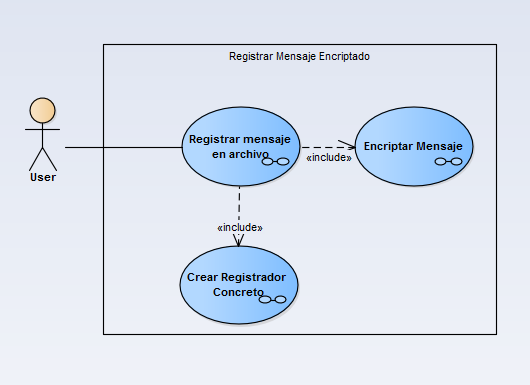
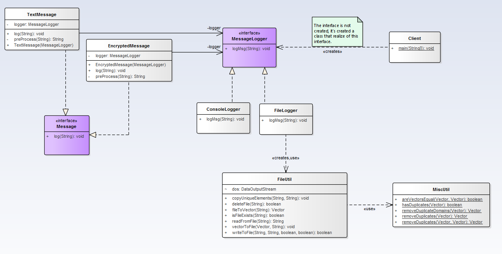

# Bridge

>"Define separate inheritance hierarchies for an abstraction and its implementation. Abstraction delegates its implementation to an Implementor object instead of committing to an implementation at compile-time."

## Model

## Example

### Functional Model
  

### Structural Model
  
>
