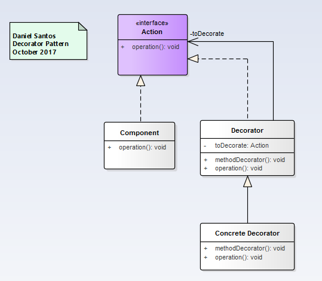
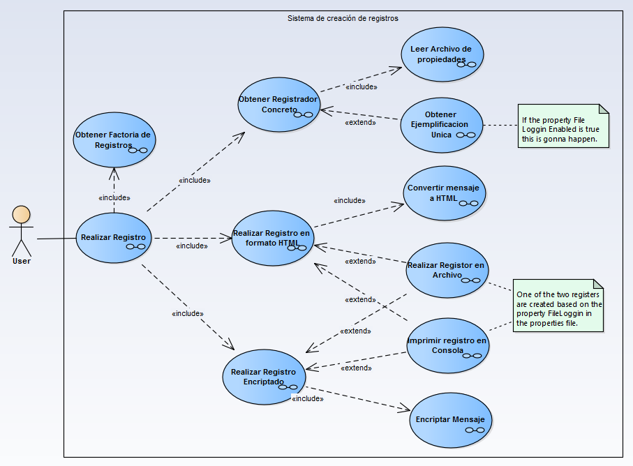
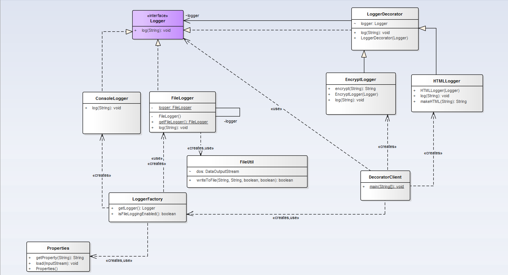

# Decorator

>"Define separate Decorator objects that add responsibilities to an object. Work through Decorator objects to extend the functionality of an object at run-time."

## Model

## Example

### Functional Model
  

### Structural Model
  
>
