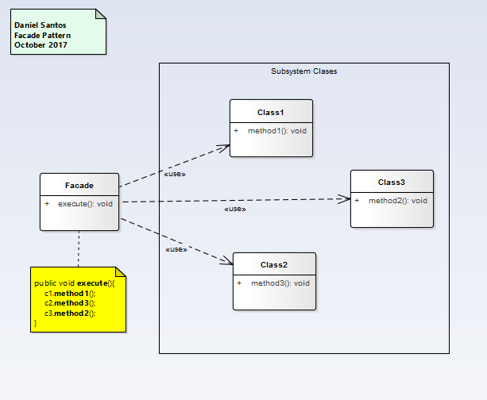
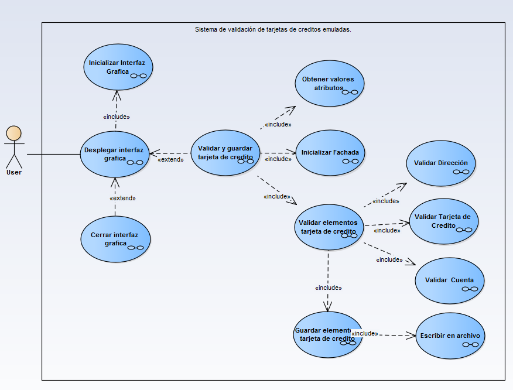
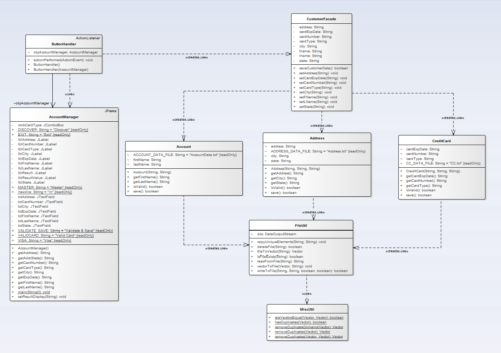

# Facade

>"Provide an unified interface to a set of interfaces in a subsystem. Facade defines a higher-level interface that makes the subsystem
easier to use." [GoF]

## Model

## Example

### Functional Model
  

### Structural Model
  
>
