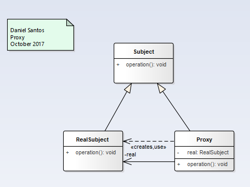
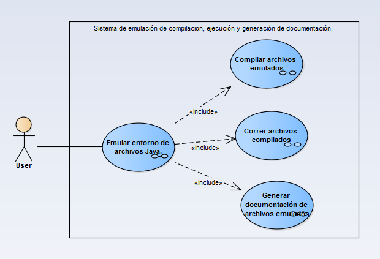
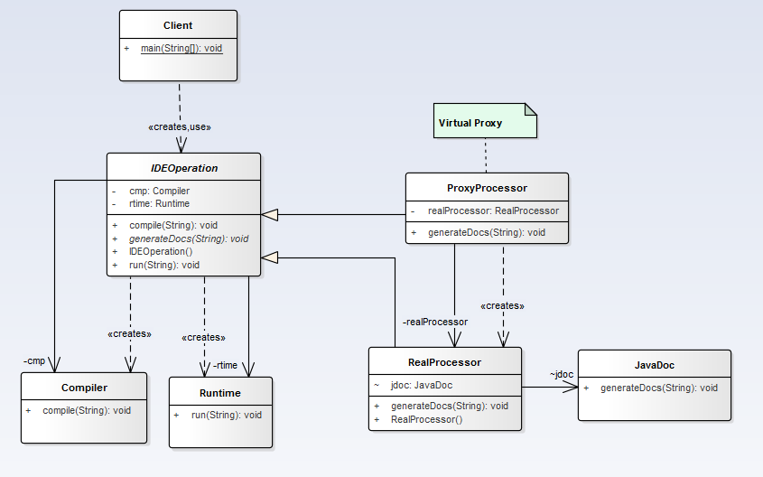

# Proxy - Surrogate

>"Provide a surrogate or placeholder for another object to control access to it." [GoF]

## Model

### Counting Proxy example

#### Functional Model
  

#### Structural Model
  

### Virtual Proxy

#### Functional Model
  

#### Structural Model
  
