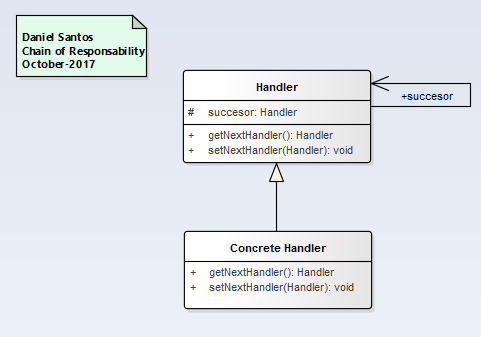

# Structural   Patterns
  __"Deal with delegating responsibilities to other objects."__

### [Adapter](Adapter/readme.md)
__"Allows the conversion of the interface of a class to another interface that client expects. Communicate incompatible interfaces."__

### [Bridge](Bridge/readme.md)
__"Allows the separation of an abstract interface from its implementation."__

### [Chain of responsability](ChainResponsibility/readme.md)
__"Avoid coupling a (request) sender object to a receiver object. Allows a sender object to pass its request along a chain of objects without having any knowledge about which object will handle the request."__

### [Decorator](Decorator/readme.md)
__"Extends the functionality of an objects in a manner that is transparent to its clients without using inheritance."__

### [Facade](Facade/readme.md)
__"Provide a higher level interface to a subsystem of classes, making the subsystem easier to use."__

### [Proxy](Proxy/readme.md)
__"Allows a separate object to be used as a substitute to provide controlled access to an object that is not accessible by normal means."__

  - [Virtual proxy](Proxy/VirtualProxy/readme.md): Helps to create objects on demand (until required)
  - [Counting proxy](Proxy/CountingProxy/readme.md): To provide some kind of audit mechanism before executing a method on a target object.
