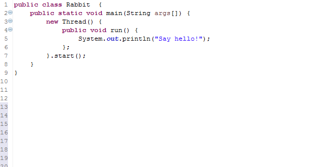
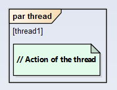

# Design patterns

The following patterns are described, for each pattern is shown the model and example with code; Each example has source code, functional model, structural model and the behavioral model is attached in inside the binary file of the model due the size of the model. You can click on the link to go to the model.

## Projects Created using Design patterns
 - [Orders Project](https://github.com/xdanielsb/OrdersProject)
 - [Symbolic Expressions](https://github.com/xdanielsb/SymbolicExpressions)

## Design Patterns

- Basic patterns
  - Abstract
  - Interface
- [Creational patterns (See general description)](CreationalPatterns/readme.md)
  - [Abstract Factory](CreationalPatterns/abstract_factory/readme.md)
  - [Factory Method](CreationalPatterns/factory_method/readme.md)
  - [Singleton](CreationalPatterns/singleton/readme.md)
  - [Object Pool](CreationalPatterns/object_pool/readme.md)
  - [Prototype](CreationalPatterns/prototype/readme.md)
  - [Builder](CreationalPatterns/builder/readme.md)
- [Collectional patterns (See general description)](CollectionalPatterns/readme.md)
  - [Composite](CollectionalPatterns/Composite/readme.md)
  - [Iterator](CollectionalPatterns/Iterator/readme.md)
  - [FlyWeight](CollectionalPatterns/Flyweight/readme.md)
  - [Visitor](CollectionalPatterns/Visitor/readme.md)
- [Structural patterns (See general description)](StructuralPatterns/readme.md)
  - [Adapter](StructuralPatterns/Adapter/readme.md)
  - [Bridge](StructuralPatterns/Bridge/readme.md)
  - [Chain of Responsibility](StructuralPatterns/ChainResponsibility/readme.md)
  - [Proxy](StructuralPatterns/Proxy/readme.md)
    - [Counting Proxy](StructuralPatterns/Proxy/CountingProxy/readme.md)
    - [Virtual Proxy](StructuralPatterns/Proxy/VirtualProxy/readme.md)
  - [Decorator](StructuralPatterns/Decorator/readme.md)
  - [Facade](StructuralPatterns/Facade/readme.md)
- [Behavioural Patterns (See general description)](BehaviouralPatterns/readme.md)
  - [Command](BehaviouralPatterns/Command/readme.md)
  - [Interpreter](BehaviouralPatterns/Interpreter/readme.md)
  - [Mediator](BehaviouralPatterns/Mediator/readme.md)
  - [Memento](BehaviouralPatterns/Memento/readme.md)
  - [Observer](BehaviouralPatterns/Observer/readme.md)
  - [State](BehaviouralPatterns/State/readme.md)
  - [Strategy](BehaviouralPatterns/Strategy/readme.md)
  - [Template](BehaviouralPatterns/Template/readme.md)
- [Concurrency Patterns (See general description)](#)
  - [Consistent Lock Order](ConcurrencyPatterns/)
  - [Critical Section](ConcurrencyPatterns/)
  - [Guarded Suspension](ConcurrencyPatterns/)
  - [Read-Write Lock](ConcurrencyPatterns/)

## Notations

<table style="width:100%">
 <tr>
   <th> Structure / Element </th>
   <th> Code </th>
   <th> Notation </th>
 </tr>
 <tr>
   <td>Class</td>
   <td>
   
   </td>
   <td>
   
   </td>
 </tr>
 <tr>
   <td>Interface</td>
   <td>
   
   </td>
   <td>
   
   </td>
 </tr>
 <tr>
   <td>Abstract Class</td>
   <td>
   
   </td>
   <td>
   
   </td>
 </tr>
 <tr>
   <td>Static Method</td>
   <td>
   
   </td>
   <td>
   
   </td>
 </tr>
 <tr>
   <td>Condition If</td>
   <td>
   
   </td>
   <td>
   
   </td>
 </tr>
 <tr>
   <td>Critical section</td>
   <td>
   
   </td>
   <td>
   
   </td>
 </tr>
 <tr>
   <td>Try catch</td>
   <td>
   
   </td>
   <td>
   
   </td>
 </tr>
 <tr>
   <td>Threads</td>
   <td>
   
   </td>
   <td>
   
   </td>
 </tr>
</table>

## Acknowledgments
  ### Partha Kuchana
  > Many of the examples shown are taken from the book of Partha Kuchana

  ### Henry Diosa
  > Teacher at Universidad Distrital has contributed with his teachings and experience.
  [linkedin](https://www.linkedin.com/in/henry-alberto-diosa-577136bb/)
