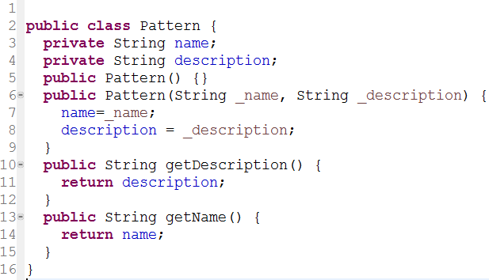
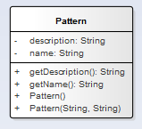

# Design patterns

In this project we describe design patterns  which are divided in the following categories

1. Basic patterns
  * Abstract
  * Interface
2. Creational patterns
  * [Abstract Factory](CreationalPatterns/abstract_factory/readme.md)
  * [Factory Method](CreationalPatterns/factory_method/readme.md)
  * [Singleton](CreationalPatterns/singleton/readme.md)
  * [Prototype](CreationalPatterns/prototype/readme.md)
  * [Builder](CreationalPatterns/builder/readme.md)
3. Collectional patterns
  * [Composite]()
  * [Iterator]()
  * [FlyWeight]()
  * [Visitor]()

## Notations

<table style="width:100%">
 <tr>
   <th> Structure / Element </th>
   <th> Code </th>
   <th> Notation </th>
 </tr>
 <tr>
   <td>Class</td>
   <td>
   
   </td>
   <td>
   
   </td>
 </tr>
</table>
