# Design patterns

In this project we describe design patterns  which are divided in the following categories

The following patterns are described, for each pattern is shown the model and example with code; Each example has source code, functional model, structural model and the behavioural model is attached in inside the binary file of the model due the size of the model. You can click on the link to go to the model.

- Basic patterns
  - Abstract
  - Interface
- [Creational patterns](CreationalPatterns/readme.md)
  - [Abstract Factory](CreationalPatterns/abstract_factory/readme.md)
  - [Factory Method](CreationalPatterns/factory_method/readme.md)
  - [Singleton](CreationalPatterns/singleton/readme.md)
  - [Object Pool](CreationalPatterns/object_pool/readme.md)
  - [Prototype](CreationalPatterns/prototype/readme.md)
  - [Builder](CreationalPatterns/builder/readme.md)
- [Collectional patterns](CollectionalPatterns/readme.md)
  - [Composite](CollectionalPatterns/composite/readme.md)
  - [Iterator](CollectionalPatterns/iterator/readme.md)
  - [FlyWeight](CollectionalPatterns/flyweight/readme.md)
  - [Visitor](CollectionalPatterns/visitor/readme.md)
- [Structural patterns](StructuralPatterns/readme.md)
  - [Adapter](StructuralPatterns/Adapter/readme.md)
  - [Bridge](StructuralPatterns/Adapter/readme.md)
  - [Chain of Responsibility](StructuralPatterns/Adapter/readme.md)
  - [Counting Proxy](StructuralPatterns/Adapter/readme.md)
  - [Decorator](StructuralPatterns/Adapter/readme.md)
  - [Facade](StructuralPatterns/Adapter/readme.md)
  - [Virtual Proxy](StructuralPatterns/Adapter/readme.md)

## Notations

<table style="width:100%">
 <tr>
   <th> Structure / Element </th>
   <th> Code </th>
   <th> Notation </th>
 </tr>
 <tr>
   <td>Class</td>
   <td>
   
   </td>
   <td>
   
   </td>
 </tr>
 <tr>
   <td>Interface</td>
   <td>
   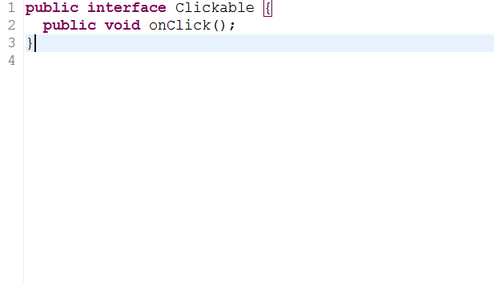
   </td>
   <td>
   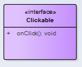
   </td>
 </tr>
 <tr>
   <td>Abstract Class</td>
   <td>
   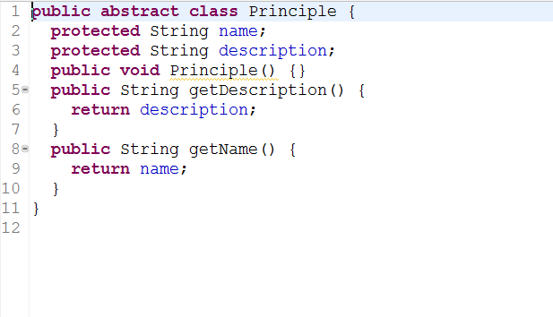
   </td>
   <td>
   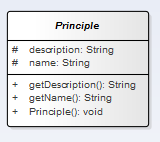
   </td>
 </tr>
 <tr>
   <td>Static Method</td>
   <td>
   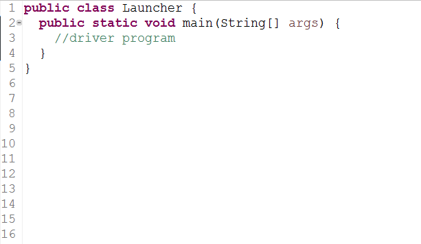
   </td>
   <td>
   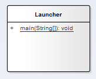
   </td>
 </tr>
 <tr>
   <td>Condition If</td>
   <td>
   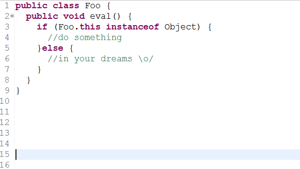
   </td>
   <td>
   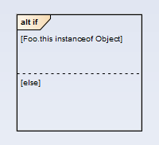
   </td>
 </tr>
 <tr>
   <td>Critical section</td>
   <td>
   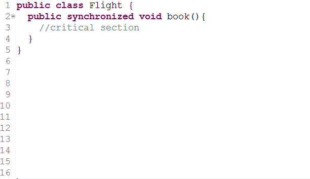
   </td>
   <td>
   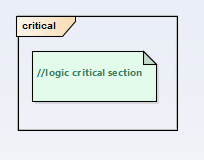
   </td>
 </tr>
 <tr>
   <td>Try catch</td>
   <td>
   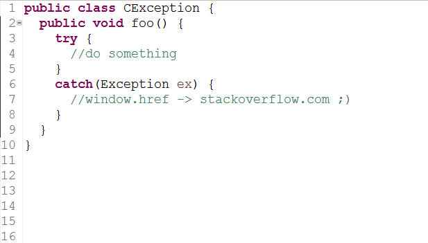
   </td>
   <td>
   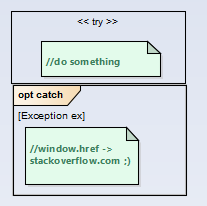
   </td>
 </tr>
</table>

## Acknowledgments
  ### Partha Kuchana
  > Many of the examples shown are taken from the book of Partha Kuchana

  ### Henry Diosa
  > Teacher at Universidad Distrital has contributed with his teachings and experience.
